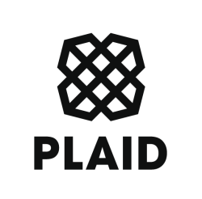

# FinTech Case Study

## Description

Plaid is a software company that provides API’s for application software to communicate with banks
about customer accounts via language agnostic JSON. [^1]

[^1]: Plaid Case Study Proposal

**Contributors**
Marcela Castaño

### FinTech Case Study: Plaid

#### *What is the background of your company?*

"Plaid was founded in 2013 by Zach Perret and William Hockey. The pair originally attempted to build consumer financial management products, including budgeting and bookkeeping software. When confronted with difficulties in connecting bank accounts required for these tools, they decided to pivot their core business focus to a unified banking API." [^2]

[^2]: [Wikipedia](https://en.wikipedia.org/wiki/Plaid_(company))

#### *What do they do? Who are their competitors?*

Plaid allows users to connect their bank accounts.

Competitors: Nymbus, Yapily, Solarisbank, Orum, Tink and more. [^3]

[^3]: [CBNInsights](https://www.cbinsights.com/company/plaid-technologies/competitors-partners)

#### *How does this company use technology to their advantage? Why are they considered a FinTech company?*

#### *Why is this company exemplary in the FinTech space? What are their strengths and weaknesses?*

#### *What is the prognosis for this company? Where do they expect to be in the future?*
