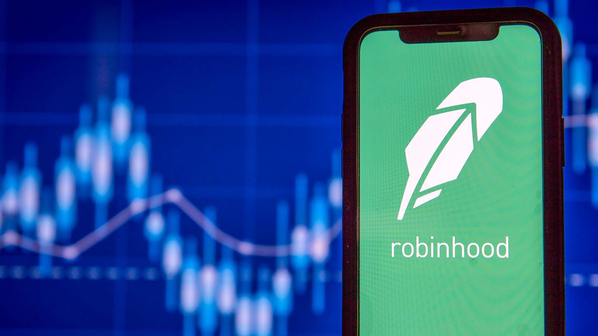

# Robinhood Case Study

## By Krishan Kandial, Andrew Hidalgo, and Frank Lau

### Report of Case Study
 * Robinhood is an online brokerage firm that pioneered the modern day buzz of commission-free trading. 
 * Robinhood was founded in 2013 in Mendell Park, California
* Robinhood's competitors are other online brokerages like Fidelity, WeBull, TDAmeritrade, Charles Schwab, and etc.
* Robinhood is exemplary in the FinTech space because of its commission-free trading, easy UI regarding options trading, and a paid subscription access to Level 2 data
* Robinhood's current weakness is its social standing and extremely limited customer service and lack of basic investment features such as IRA accounts. Due to their obligation to their clearing companies, Robinhood is under scrutiny by the general public because of their stoppage in trading $GME, $AMC, and other heavily shorted stocks.
